# Demos
This repository contains the source code for the demos I use for the undergraduate and graduate course on Computer Vision. 

## Contents
1. __Images__
 - Digitization (Python script: digitization.py)
   
   
 - Borders (Python script: borders.py)
    
   
2. __Edges__
 - Derivative calculation example (R script: edge_example.r)
   
    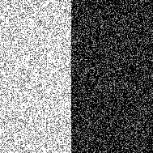 
    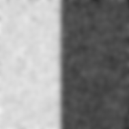
    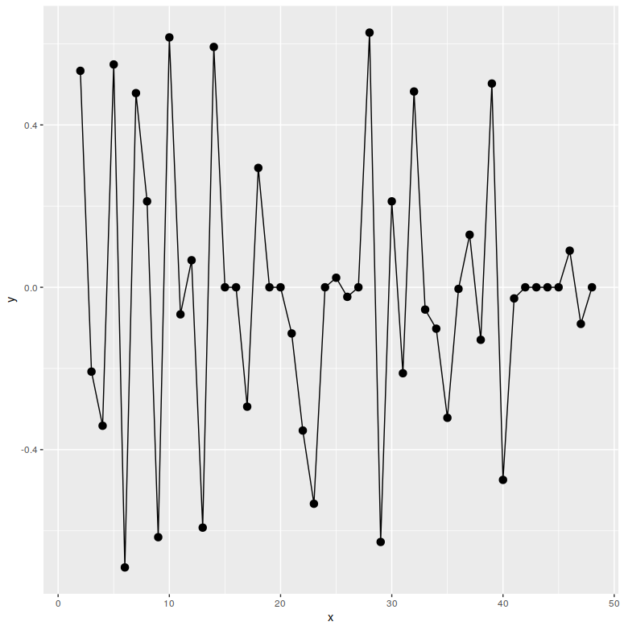
    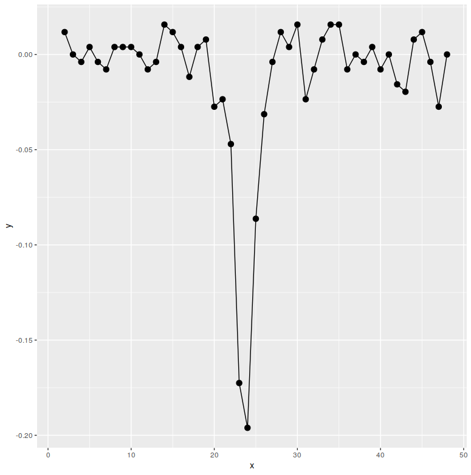
 
 - Hough Transform (Python script: hough.py)
 
    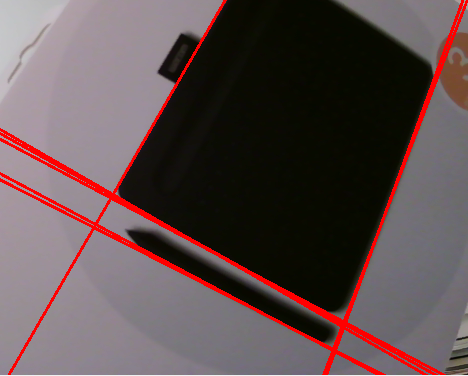
   
3. __Geometric transformations__
 - Transformations (Python script: transformations.py)
   
    

4. __Interest points__
 - Principal Component Analysis (R script: PCA.r)
   
    

10. __Image Classification__
 - Working with CIFAR10 dataset (CIFAR10_dataset.ipynb)

 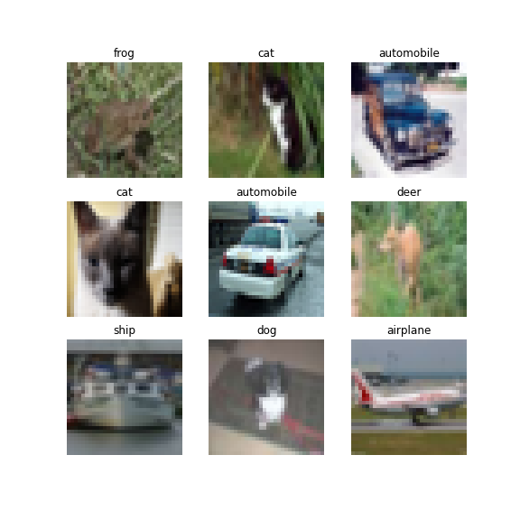

 - k-Nearest Neighbours (NearestNeighbours.ipynb) 

 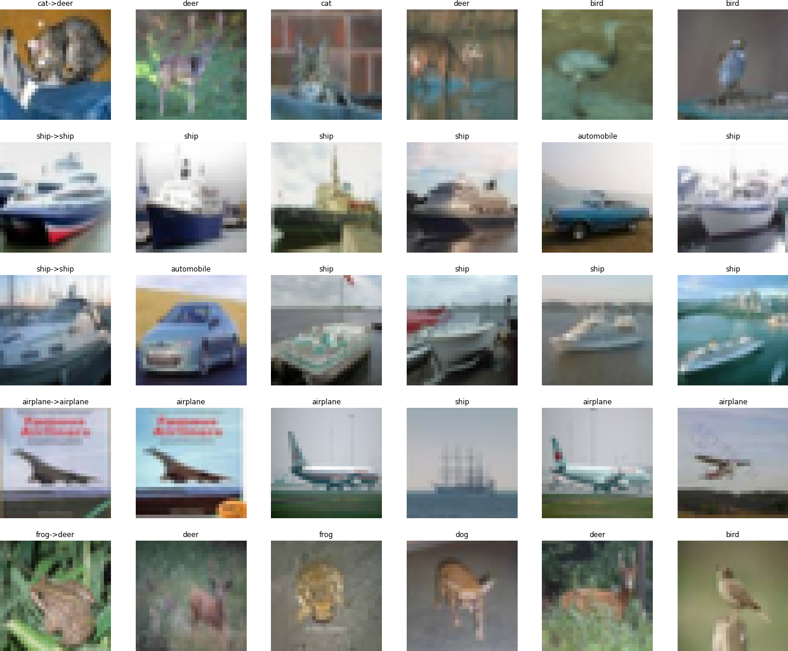

 - Linear Classifier Weights (LinearClassifier.ipynb) 

 

 - Cross-Validation k-NN (CrossValidation.ipynb) 

 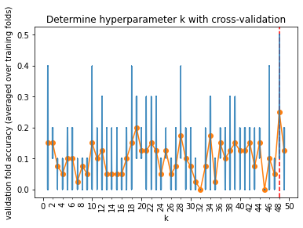

 - Gradient Descent (GradientDescent.ipynb)

 - Basic Neural Network (NeuralNetwork.ipynb)

 - Convolutional Autoencoder (Autoencoder.ipynb)

 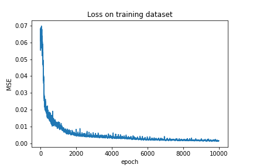
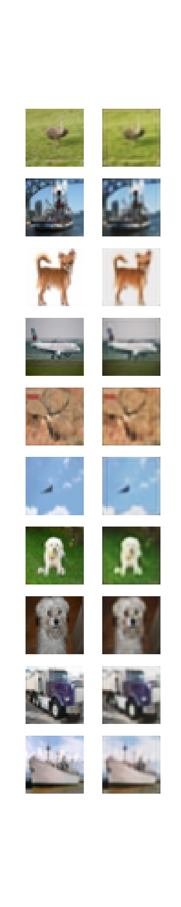

 - Convolutional Autoencoder with Linear Bottleneck (Autoencoder_w_bottleneck.ipynb)

 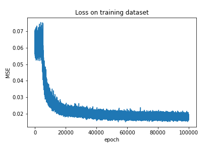
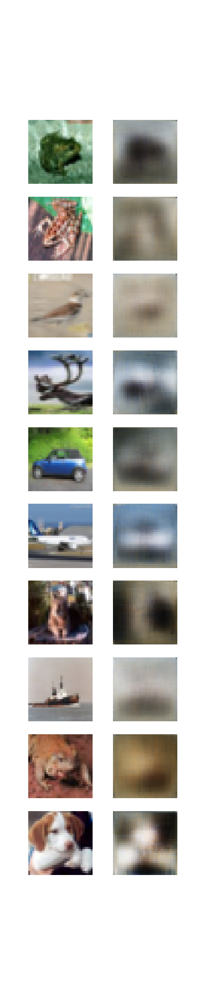

