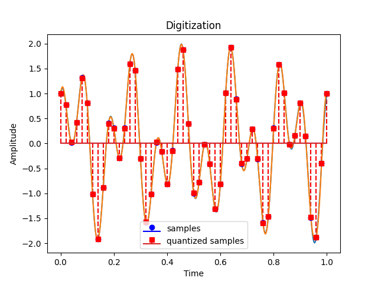

# Demos
This repository contains the source code for the demos I use for the undergraduate and graduate course on Computer Vision. 

## Contents
1. Images
 - Digitization (Python script: digitization.py)
    
2. Edges